# Etapa 1 — Stack e modelo de dados

Documento de decisão. Nenhum código foi escrito ainda, conforme a ordem de
construção do brief (seção 12). As regras do motor de pontos estão em
`02-regras-confirmadas.md`.

---

## 1. Stack recomendada

Confirmo a sugestão do brief, com as escolhas fechadas:

| Camada | Escolha | Por quê |
|---|---|---|
| Framework | Next.js 15 (App Router) + TypeScript | Um único projeto para tela e servidor. As regras de acesso rodam no servidor por padrão, que é exatamente o que a seção 2 exige. |
| Estilo | Tailwind CSS | Rápido de ajustar e responsivo de verdade sem CSS espalhado. |
| Banco | Postgres (Neon) | Plano gratuito suficiente para 4 pessoas, backup automático, sem servidor para manter. |
| Acesso ao banco | Prisma | O modelo de dados vira um arquivo legível; migrações versionadas. |
| Login | Sessão própria, cookie `httpOnly` + `Secure` + `SameSite=Lax`, senha com Argon2id | Não precisamos de OAuth nem provedor externo: são 4 logins fixos por usuário e senha. Sessão em tabela permite revogar acesso. |
| Leitura do .xlsx | SheetJS (`xlsx`) | Lê a planilha no servidor, sem depender de Excel. |
| Testes | Vitest (unidade) + Playwright (fluxo e isolamento por loja) | Cobre os 5 itens obrigatórios da seção 11. |
| Publicação | Vercel (app) + Neon (banco) | Deploy pelo GitHub, sem terminal. É o caminho mais curto para você manter isso sozinho. |
| Arquivos originais | Vercel Blob | Guarda o .xlsx de cada importação, como pede a seção 8.4. |

**Custo esperado:** R$ 0/mês nos planos gratuitos, para o volume de 3 lojas e
uma importação por dia. Se um dia passar disso, Neon e Vercel cobram por uso,
não por assinatura fixa.

**O que isso te obriga a manter:** uma conta GitHub, uma Vercel e uma Neon.
Atualizações do app são um `git push`. Backup do banco é automático no Neon.

---

## 2. Decisões de arquitetura que sustentam o resto

### 2.1 O relatório cru é a fonte da verdade; todo o resto é derivado

Guardamos cada linha importada exatamente como veio (`acumulado_importado`,
imutável). Delta, pontos e bônus são **recalculados** a partir dela, nunca
digitados nem corrigidos à mão.

Consequência prática: se uma meta for corrigida em outubro, ou uma vendedora
for marcada como "não conta", **o mês inteiro se recalcula sozinho** e os
números continuam batendo. Sem isso, cada correção viraria um bug silencioso.

O recálculo é idempotente (rodar duas vezes dá o mesmo resultado) e é disparado
por: confirmar importação, lançar/editar CRM, editar metas, editar regras de
pontuação, e mudar o cadastro de uma vendedora.

### 2.2 Delta (seção 5 do brief)

`resultado_do_dia = acumulado da importação oficial de hoje − acumulado da
importação oficial do dia anterior`.

- **Oficial do dia** = a importação mais recente daquele dia. Guardamos todas,
  mas só a oficial entra na conta.
- **Primeira importação do mês**: a base é zero, então o resultado do dia é o
  próprio acumulado.
- **Duas importações no mesmo dia**: a base continua sendo a última do dia
  *anterior*. Nunca a importação anterior do mesmo dia.

### 2.3 P.A., Conversão e CRM nunca são subtraídos

São razões. Recalculamos a partir dos componentes já deltados:

- `P.A. do dia = total_pecas_do_dia ÷ boletos_do_dia`
- `Conversão do dia = boletos_do_dia ÷ oportunidades_do_dia`
- `CRM do dia = crm_do_dia ÷ boletos_do_dia`

Denominador zero grava `null` (sem resultado), nunca `0` nem infinito. `null`
não pontua e não entra em médias — aparece na tela como "sem atendimento no
dia", não como zero.

### 2.4 Duas apurações por dia, com papéis diferentes

O app grava, para cada dia:

1. **O resultado daquele dia** (`resultado_diario`) — o delta. Alimenta o
   gráfico de 7 dias e a contagem de consistência da seção 8.3f ("em quantos
   dias ficou acima de 110%").
2. **A foto do acumulado e da projeção** (`apuracao_dia` para a vendedora,
   `apuracao_loja_dia` para a gerente) — o acumulado do mês até aquela data
   contra a meta proporcional, com faixa, pontos e bônus em R$. É a
   pontuação oficial, e é o que a tela da reunião mostra.

Por que os dois: a pontuação é **mensal** (ver `02-regras-confirmadas.md`, R1),
mas a reunião é diária. O item 1 responde "como foi ontem"; o item 2 responde
"quanto isso vale no bônus".

### 2.5 Isolamento por loja no servidor

Toda leitura passa por uma função única que recebe a sessão e devolve as lojas
permitidas. Gerente = uma loja; admin = as três, com uma loja selecionada por
vez. Nenhuma consulta aceita `loja_id` vindo da URL sem passar por essa
checagem. É isso que o teste da seção 11 verifica.

### 2.6 Quem "conta como vendedora" é calculado, nunca fixado

O número de vendedoras ativas no mês sai de: `conta_como_vendedora = true`
**e** ativa em algum momento do mês. As metas de Valor, Pares e Bolsas da
vendedora são divididas por esse número no momento do cálculo. Nunca gravamos
meta individual fixa — assim, quando alguém entra ou sai, a divisão se corrige
em todo o mês.

O mesmo filtro vale para os totais da loja que apuram a gerente: quem não
conta fica de fora do numerador e do denominador.

---

## 3. Modelo de dados

Catorze tabelas. As de cima guardam o que foi importado ou digitado; as de
baixo são calculadas e podem ser apagadas e refeitas sem perder nada.

```mermaid
erDiagram
    loja ||--o{ usuario : "gerente pertence a"
    loja ||--o{ vendedora : "carteira"
    loja ||--o{ meta_mensal : "metas do mes"
    loja ||--o{ config_mes : "valor do ponto"
    loja ||--o{ regra_pontuacao : "pontos por indicador"
    loja ||--o{ faixa_pontuacao : "faixas de %"
    loja ||--o{ acumulado_importado : "bloco do relatorio"
    loja ||--o{ apuracao_loja_dia : "pontos da gerente"

    usuario ||--o{ importacao : "envia"
    usuario ||--o{ sessao : "abre"
    usuario ||--o{ reuniao : "registra"

    importacao ||--o{ acumulado_importado : "linhas cruas"

    vendedora ||--o{ vendedora_alias : "nomes no relatorio"
    vendedora ||--o{ acumulado_importado : "linha"
    vendedora ||--o{ resultado_diario : "delta do dia"
    vendedora ||--o{ crm_diario : "lancamento manual"
    vendedora ||--o{ apuracao_dia : "pontos"
    vendedora ||--o{ reuniao : "reuniao diaria"

    resultado_diario ||--o{ apuracao_dia : "alimenta"
    crm_diario ||--o| apuracao_dia : "alimenta CRM"

    loja {
        uuid id PK
        text slug "barra padre park"
        text nome
        text endereco
        text chave_relatorio "texto que identifica o bloco no xlsx"
    }
    usuario {
        uuid id PK
        text username UK
        text senha_hash "argon2id"
        text papel "admin ou gerente"
        uuid loja_id FK "null para admin"
        bool ativo
    }
    sessao {
        uuid id PK
        uuid usuario_id FK
        timestamptz expira_em
    }
    vendedora {
        uuid id PK
        uuid loja_id FK
        text nome
        bool conta_como_vendedora "default true"
        date ativa_desde
        date arquivada_em "null se ativa"
    }
    vendedora_alias {
        uuid id PK
        uuid vendedora_id FK
        text nome_no_relatorio UK
    }
    importacao {
        uuid id PK
        text arquivo_nome
        text arquivo_url "blob do xlsx original"
        text sha256 UK "evita subir o mesmo arquivo duas vezes"
        date data_referencia
        timestamptz extraido_em
        uuid importado_por FK
        text status "pendente confirmada descartada"
    }
    acumulado_importado {
        uuid id PK
        uuid importacao_id FK
        uuid loja_id FK
        uuid vendedora_id FK
        numeric valor
        numeric meta_valor "coluna Meta do relatorio"
        numeric pa
        numeric conversao
        int oportunidades
        int boletos
        int calcados
        int bolsas
        int total
    }
    resultado_diario {
        uuid id PK
        uuid vendedora_id FK
        date data
        uuid importacao_id FK "oficial do dia"
        uuid importacao_base_id FK "oficial do dia anterior null na primeira do mes"
        numeric valor
        int calcados
        int bolsas
        int boletos
        int oportunidades
        int total_pecas
        numeric pa "null se boletos zero"
        numeric conversao "null se oportunidades zero"
        numeric meta_valor_mes "foto da meta do relatorio"
    }
    crm_diario {
        uuid id PK
        uuid vendedora_id FK
        date data
        int vendas_influenciadas "quantidade digitada pela gerente"
        uuid registrado_por FK
    }
    meta_mensal {
        uuid id PK
        uuid loja_id FK
        date mes_referencia "dia 1"
        numeric valor_loja
        numeric pares_loja
        numeric bolsas_loja
        numeric pa "fixa igual para loja e vendedora"
        numeric conversao "fixa igual para loja e vendedora"
        numeric crm "fixa igual para loja e vendedora"
    }
    config_mes {
        uuid id PK
        uuid loja_id FK
        date mes_referencia
        numeric valor_ponto_vendedora "R$ 15"
        numeric valor_ponto_gerente "R$ 25"
    }
    regra_pontuacao {
        uuid id PK
        uuid loja_id FK
        date mes_referencia
        text indicador "VALOR PARES BOLSAS PA CONVERSAO CRM"
        numeric pontos_base
        numeric pontos_alto
        bool rateia_por_vendedora "true em VALOR PARES BOLSAS"
        bool proporcional_aos_dias "true em VALOR PARES BOLSAS"
        bool ativo "permite ligar OCULOS depois"
    }
    faixa_pontuacao {
        uuid id PK
        uuid loja_id FK
        date mes_referencia
        int ordem
        numeric pct_min "inclusivo"
        numeric pct_max "inclusivo null igual infinito"
        text tipo "ZERO MEIO BASE ALTO"
        numeric pontos_fixos "so para MEIO igual 0,5"
    }
    apuracao_dia {
        uuid id PK
        uuid vendedora_id FK
        date data
        text indicador
        numeric realizado_dia "delta do dia"
        numeric meta_dia
        text faixa_dia "para a contagem de consistencia"
        numeric acumulado "do mes ate a data"
        numeric meta_proporcional
        numeric pct "igual ao pct da tendencia"
        text faixa
        numeric pontos
        numeric bonus_reais
    }
    apuracao_loja_dia {
        uuid id PK
        uuid loja_id FK
        date data
        text indicador
        numeric acumulado "total da loja"
        numeric meta_proporcional "meta da loja"
        numeric pct
        text faixa
        numeric pontos
        numeric bonus_reais "pontos vezes valor_ponto_gerente"
    }
    reuniao {
        uuid id PK
        uuid vendedora_id FK
        date data
        uuid registrado_por FK
        text pauta
        text acordos
        text observacoes
        text proximos_passos
    }
```

### Chaves únicas que garantem a integridade

- `usuario.username`
- `vendedora (loja_id, nome)` e `vendedora_alias.nome_no_relatorio`
- `importacao.sha256`
- `acumulado_importado (importacao_id, vendedora_id)`
- `resultado_diario (vendedora_id, data)`
- `crm_diario (vendedora_id, data)`
- `meta_mensal (loja_id, mes_referencia)`, `config_mes (loja_id, mes_referencia)`
- `regra_pontuacao (loja_id, mes_referencia, indicador)`
- `apuracao_dia (vendedora_id, data, indicador)`
- `apuracao_loja_dia (loja_id, data, indicador)`
- `reuniao (vendedora_id, data)`

### As duas colunas que evitam código com `if` de indicador

`regra_pontuacao.rateia_por_vendedora` e `regra_pontuacao.proporcional_aos_dias`
são `true` para VALOR, PARES e BOLSAS, e `false` para P.A., CONVERSÃO e CRM.
Com isso, o motor de pontos é **um único laço sobre os seis indicadores**, sem
tratar nenhum caso especial no código. Se um dia um indicador mudar de
comportamento, muda uma linha no banco.

### Por que existe `vendedora_alias`

O relatório escreve o nome como o sistema da loja escreve. Se um dia sair
"ANA P." em vez de "ANA PAULA", sem alias o app criaria uma segunda pessoa e
partiria o histórico em dois. Com alias, a tela de importação mostra o nome
desconhecido na prévia e a gerente decide: é gente nova, ou é a Ana Paula com
outro nome. Nada é gravado antes dessa decisão.

### Por que `apuracao_dia` é gravada, e não só calculada na hora

Precisamos de "quantos dias ela ficou acima de 110%" (seção 8.3f) e do gráfico
de 7 dias (8.3d). Gravar cada dia por indicador torna essas telas uma consulta
simples e rápida no celular. Como é derivada, pode ser apagada e refeita
inteira a qualquer momento.

---

## 4. Premissas que assumi (me corrija se estiver errado)

1. **Mês de referência inicial**: o brief traz as metas como "agosto/2026", mas
   estamos em setembro/2026. Vou semear as metas para setembro/2026 com esses
   valores, editáveis na tela de metas.
2. **Fuso horário**: tudo em `America/Sao_Paulo`. "Dia" é o dia civil de Porto
   Alegre, não UTC — importante porque a extração é às 17h50.
3. **Dias decorridos**: contados do dia 1 até a data da última importação
   oficial, em dias corridos. A meta diária e a proporcional usam dias
   corridos do mês (30 em setembro), não dias úteis — é o que a seção 6 diz.
4. **Domingo/feriado sem venda**: um dia sem movimento entra como zero e puxa a
   projeção para baixo. Se as lojas fecham em algum dia, isso distorce a
   tendência — me avise que eu trato.
5. **"Subtotal"**: usado só para conferir a soma do bloco na importação; se não
   bater, a importação é bloqueada com erro claro. Nunca vira vendedora.
6. **"ALVARO"**: entra como vendedora com `conta_como_vendedora = false` já no
   seed das três lojas.
7. **Óculos**: nem no banco, nem na tela. `regra_pontuacao.ativo` permite ligar
   no futuro sem alterar código.
8. **Meta de VALOR da vendedora**: vem da coluna `Meta` do relatório, com
   aviso na importação se a soma divergir mais de 1% da meta da loja. Detalhe
   em `02-regras-confirmadas.md`.
